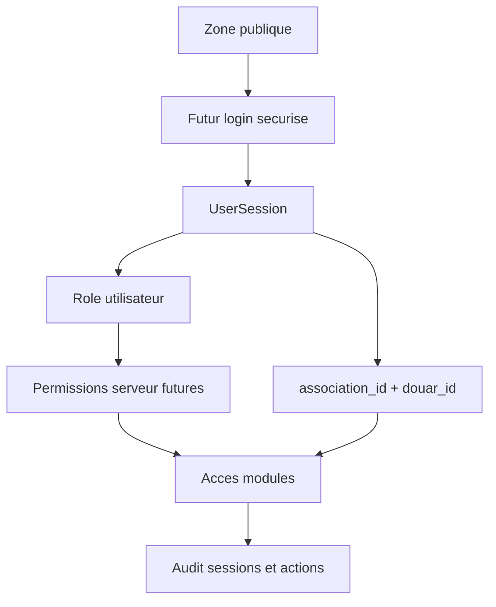

# Architecture Auth future - AGADIRNETGUIDA

Ce dossier prepare une future authentification reelle sans la connecter maintenant.

Important : cette structure ne contient :

- aucune vraie connexion
- aucun token reel
- aucun backend auth
- aucun client Supabase actif
- aucun JWT actif
- aucune cle API
- aucune securite trompeuse

L'application actuelle continue avec ses routes et permissions frontend existantes.

## Objectif

Preparer une migration future vers une authentification securisee, sans casser l'application actuelle.

La future auth devra gerer :

- session utilisateur
- roles
- permissions
- acces par module
- separation public / interne / administratif
- recuperation mot de passe
- audit des sessions
- multi-associations
- multi-douars

## Zones d'acces

### Public

Routes accessibles sans session future :

- accueil
- inscription
- espace habitant public
- annonces publiques
- documents publics
- signalement public
- a propos
- memoire orale publique
- patrimoine public
- chronologie publique
- carte communautaire publique

### Interne

Routes futures avec session valide :

- membres
- cotisations
- workflows
- statistiques
- gestion bureau
- mosquee

Roles prevus :

- bureau
- president

### Administratif

Operations futures plus sensibles :

- gestion permissions
- multi-associations
- multi-douars
- audit sessions
- changement de role

Role principal prevu : president, avec verification serveur future.

## Interfaces preparees

Voir `src/types/auth.ts` :

- `UserSession`
- `AuthState`
- `ProtectedRouteRule`
- `ModuleAccessRule`
- `PasswordRecoveryRequest`
- `SessionAuditEntry`
- `FutureTokenPolicy`

## Diagramme logique simple

## Strategie future Supabase Auth

Supabase Auth pourra etre etudie plus tard, apres validation du besoin reel.

A preparer avant connexion :

- projet Supabase separe
- variables d'environnement validees
- politique RLS par table
- roles stockes cote serveur
- audit des changements de role
- procedure de recuperation mot de passe
- duree des sessions
- revue securite avant production

A ne pas faire maintenant :

- ajouter `createClient`
- ajouter URL Supabase
- ajouter anon key
- ajouter service role key
- ajouter JWT actif
- ajouter stockage local de tokens

## Politique future tokens

Voir `conventions.ts`.

Principes :

- les tokens ne doivent pas etre inventes par l'application
- les roles doivent etre verifies cote serveur
- le frontend ne decide pas seul de la securite
- les sessions doivent expirer
- les actions sensibles doivent etre journalisees

## Recuperation mot de passe

Future seulement.

Le flux devra etre gere par le fournisseur auth choisi.
Le projet ne doit jamais stocker de mot de passe en clair.

## Audit sessions

Evenements futurs a journaliser :

- login
- logout
- refresh
- password_reset_requested
- role_changed
- session_expired

Ces evenements seront rattaches a :

- user_id
- association_id
- douar_id
- role
- date

## Multi-associations et multi-douars

Toute session future doit porter un contexte :

- associationId
- douarId
- role

Cela permet :

- autonomie locale
- isolation des donnees
- gouvernance locale
- extension territoriale progressive

## Conventions

- Les types auth vivent dans `src/types/auth.ts`.
- Les helpers non actifs vivent dans `src/lib/auth/`.
- Aucune route actuelle ne doit dependre de ces helpers tant que l'auth reelle n'est pas validee.
- Les permissions frontend actuelles restent une preparation UI, pas une garantie serveur.
- Le futur backend devra appliquer les memes permissions cote serveur.

## Fichiers

- `state.ts` : etat auth non configure
- `protectedRoutes.ts` : regles futures de routes protegees
- `conventions.ts` : conventions et politique future tokens
- `index.ts` : exports centralises

Ce dossier est une preparation structurelle, pas une authentification active.
