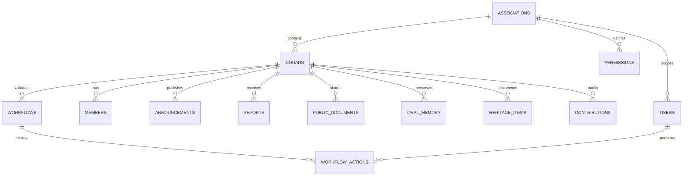

# Architecture data future - AGADIRNETGUIDA

Ce dossier prepare la future base de donnees reelle sans connecter le projet actuel.

Important : cette structure ne contient :

- aucun client Supabase actif
- aucune cle API
- aucune URL backend
- aucun JWT
- aucune auth backend
- aucun Prisma
- aucune migration SQL active

L'application continue a fonctionner avec son stockage local temporaire.

## Objectif

Preparer une migration progressive vers PostgreSQL / Supabase plus tard, sans casser la version stable actuelle.

La base future doit soutenir :

- un douar pilote
- plusieurs douars plus tard
- plusieurs associations plus tard
- des modules publics
- des modules internes
- des donnees administratives protegees
- des permissions plus fines par role

## Separation des donnees

### Public

Donnees visibles publiquement apres validation :

- announcements
- public_documents
- oral_memory
- heritage_items

Regle future : public peut lire seulement les contenus publies et non sensibles.

### Interne

Donnees visibles uniquement bureau / president / roles autorises :

- members
- workflows
- workflow_actions
- reports
- contributions

Regle future : pas de liste humiliante, pas de donnees sensibles publiques, decisions humaines uniquement.

### Administratif

Donnees de structure et gouvernance :

- associations
- douars
- users
- permissions

Regle future : gestion reservee aux roles autorises, avec audit trail.

## Diagramme logique simple

## Tables preparees

- associations
- douars
- users
- members
- workflows
- workflow_actions
- announcements
- reports
- public_documents
- oral_memory
- heritage_items
- contributions
- permissions

Voir `schema.ts` pour le role de chaque table.

## Conventions de nommage

- Tables : `snake_case`, pluriel.
- Identifiants : `id`, futur UUID.
- Multi-tenant : `association_id` + `douar_id` sur les tables locales.
- Dates : `created_at`, `updated_at`, `published_at` en futur PostgreSQL.
- Statuts : valeurs simples en `snake_case`.
- Fichiers : garder uniquement metadata et chemin, jamais fichier brut dans une table.

## Strategie multi-associations et multi-douars

Chaque donnee locale future doit etre rattachee a :

- `association_id`
- `douar_id`

Cela permet :

- autonomie locale
- identite locale preservee
- gouvernance par association
- extension progressive vers un reseau territorial
- mutualisation de modeles sans melanger les donnees

## Strategie future Supabase / PostgreSQL

Etape 1 : conserver cette couche comme contrat de donnees.

Etape 2 : creer une base PostgreSQL separee, sans toucher a la production actuelle.

Etape 3 : definir migrations SQL propres avec :

- tables
- index
- contraintes
- RLS
- politiques par role
- audit trail

Etape 4 : connecter un backend/auth seulement apres validation humaine et audit securite.

## Regles de securite futures

- RLS obligatoire sur les schemas exposes.
- Les donnees internes ne doivent jamais etre lisibles publiquement.
- Les contributions ne doivent jamais devenir une liste de pression sociale.
- Les workflows ne doivent jamais valider automatiquement.
- Les permissions frontend ne remplacent jamais les permissions serveur.
- Les roles doivent etre verifies cote serveur plus tard.

## Migration depuis localStorage

La migration future devra :

1. exporter les donnees locales de demonstration
2. nettoyer les donnees non validees
3. mapper les champs vers les tables futures
4. rattacher chaque ligne a `association_id` et `douar_id`
5. importer uniquement apres validation bureau / president

## Fichiers

- `models.ts` : interfaces des modeles futurs
- `schema.ts` : blueprint logique des tables
- `tableNames.ts` : noms centralises et zones data
- `index.ts` : exports types uniquement

Ce dossier est une preparation structurelle, pas une connexion active.
